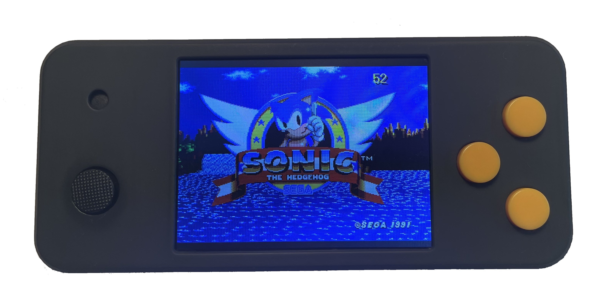
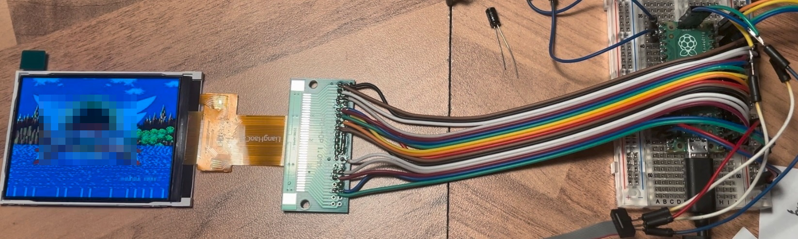

# This is Gwenesis on *Pico Held* - A Sega Genesis/Mega Drive emulator 

## by [bhzxx](https://github.com/bzhxx) ported to the *Pico Held* Handheld (a RP2040 handheld).

## Summary

This is a Sega Genesis/Mega Drive emulator running on the *Pico Held* - a RP2040 powered DIY opensource handheld.
It can playback quite some Sega Genesis games. Performance (especially sound output) majorly depends on the game played - YMMV.

## Building

Since this is intended to be built with the *Arduino* IDE building is as simple as clicking on the "upload" button. However you will need to install *Earle Philhower's* *Raspberry Pi Pico Arduino core* (no further dependencies are involved).

## Compiler switches

`#define DEBUG_DISPLAY`

Display FPS counter in the top right corner.

`#define OVERCLOCK`

Enable overclocking.

`#define ROM_HEADER_FILE`

If defined, you need to supply the ROM as header file (see romconv_hex in this repo for details). This way, there is no need to manually upload a ROM using `picotool`. However you need to reflash the whole sketch every time you want to change the ROM. So this is considered for development/debug purposes only.

`#define RUN_Z80_AFTER_MAINLOOP`

Defines at what place în the code the Z80 CPU runs. Since the sound chips are not emulated cycle accurate, the position where the Z80 CPU runs matters. E.g. `RUN_Z80_AFTER_MAINLOOP` is ok for "Lost Vikings" but it is not for "Sonic"... You may tinker a little with this one.

## Playing games

Once the sketch is uploaded to the *Pico Held* you may then upload a ROM in the next step.
To do so, you need to first convert the ROM. Use the *binary* (NOT the hex one) ROM converter that comes with this repo.
Afterwards upload the ROM to the *Pico Held* by first launching the bootloader (hold all three buttons down while powering in the *Pico Held*). Then upload the converted ROM using *picotool* found [here.](https://github.com/raspberrypi/picotool)
(See the example in the `Readme.md` in the `romconv_bin` directory.)

There is currently support for only one game at a time stored in flash however implementing a little rom selector should not be too hard.

## Notes

I ported the emulator at the very beginning when I started designing the *Pico Held* and so the *pplib* (hardware layer) that comes with this emulator is to be considered as premature. Best would be if you did not look at it at all. I just have not had the time to update the emulator to the current *pplib* library. If you're interested in the *pplib* software library for the *Pico Held* you might want to take a look at the [current version](https://github.com/fcipaq/picohero_pplib) - which is also at a very early stage of development :)

## Bugs and limitations

I found some bugs but did not have the time to fix them. There are random issues with the underlying *Gwenesis* emulator which usually result in a hard fault and are hard to track down.

Game states cannot be saved/loaded - even tough *bhzxx* provided all the infrastructure. The reason is I just didn't have the time to implement this. (Contributors welcome!)

Moreover, the RP2040 is not powerful enough to emulate all the *Mega Drive* hardware with sufficient performance. Therefore, I had to do some "tweaks" in order to improve the execution performance:

- overclocking the RP2040 approx. by a factor of 2 - *Pimoroni* does this by default with their *Picosystem* so this can't be too bad, right?!

- reducing the sampling rate in both the SN76489 as well as the YM2612 sound chip by a factor of 2.

- making the sound generation **line** or **frame** accurate (instead of **cycle** accurate). This causes the Z80 and the sound chips to get out of sync - and in many games this leads to flaws in the sound output (e.g. Sonic I: No "Sega" voice at the beginning and many more). However, this increases the performance by as much as 25 fps and I do not see a way around this other than having no sound at all.

- distributing the load to both cores. However RAM/ROM bandwidth becomes an issues and cores often stall waiting for the other core to finish access to the memory.

- swapping ROMs byte wise (bytes in a 16bit word get swapped). You will need to convert the ROM prior usage. Use the converter is included in this repo.

Feel free to report bugs/open issues and I will **try** to come up with a fix. Again: Contributors welcome.

As the framerate is below 60 fps and varies over time, the sound output has to adapt to the current framerate. The pitch will be leveled up at high framerate and leveled down at lower ones so sound output might get audibly distorted (especially music). The sound output system will *try* to keep up with the video pace.

## Running without the *Pico Held*

Of course you can run this on basically any RP2040. If you have a ILI9341 LCD with parallel connection attached you might not even need to alter the code at all.

Just be sure to get the pin assignment right (see src/pplib/setup.h)

## Credits

All credits go to [bhzxx](https://github.com/bzhxx/gwenesis) for his amazing work on the *Gwenesis* emulator! Thank you!

